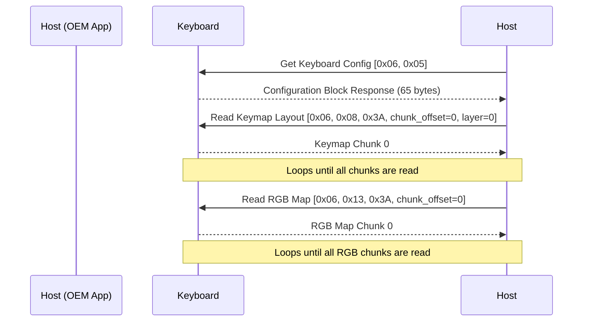

# HID Connection Sequence

This document maps the initialization state machine executed by the OEM software when discovering and connecting to the keyboard.

## 1. Device Discovery
The application uses the WebHID API (`navigator.hid`).
1. Call `navigator.hid.requestDevice({ filters: [{ vendorId: 0x36AE }] })` (or similar vendor/product ID).
2. The main Electron process automatically intercepts this (via the `select-hid-device` event in `main/index.js`) and approves the connection.
3. The frontend receives the `HIDDevice` object.

## 2. Opening the Interface
1. The software iterates through the device's `collections`.
2. It looks for the collection where `usagePage === 65280` (`0xFF00`) and `usage === 2`.
3. Calls `device.open()`.
4. Registers the `inputreport` event listener to capture responses.

## 3. Initialization Handshake
Once opened, the software immediately queries the keyboard for its state.

## 4. Response Parsing
When the keyboard responds, the `inputreport` event fires.
The software creates a `DataView` of the 64-byte payload.
* Byte 0 matches the command opcode category.
* Byte 1 typically contains a status flag or the chunk offset being returned.
* If a chunk read fails, the software implements a retry limit (exact number TBD) before throwing a disconnect error.

## 5. Firmware Updates (IAP Mode)
If a firmware update is triggered:
1. The software downloads the `.zip` from the SDCX CDN.
2. It sends the `[0x5A, 0xA0]` command to the keyboard.
3. The keyboard immediately disconnects from the USB bus and re-enumerates as `VID: 0x5566, PID: 0x0009`.
4. The software searches for the bootloader device using `usagePage === 0xFF00` and `usage === 1`.
5. The firmware payload is transferred in blocks over this new interface.
